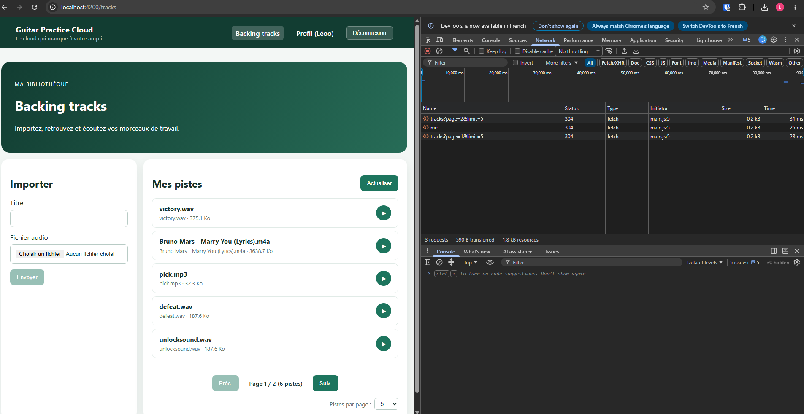

# Rapport d'usage de l'IA — TP1 & TP2

**Étudiant :** Léo Masoyé (travail individuel)  
**Outil utilisé :** Antigravity avec Gemini Flash / Gemini Pro  
**Gestion des tokens & modèles :** Suivi de la consommation via les paramètres d'Antigravity. J'ai privilégié le modèle *Flash* pour les modifications rapides et ciblées, et le modèle *Pro* pour l'analyse d'architecture et les plans de développement.

---

# TP1 — Architecture, Authentification et Profil

## Mission 0 — Cartographie de l'application

- **Objectif :** Prendre en main le projet avant de coder : comprendre le rôle des composants, le routage, le flux JWT et identifier les routes publiques et protégées dans `API_CONTRACT.md`.
- **Démarche avec l'agent :**
  - J'ai demandé à l'agent d'analyser le code existant et de m'expliquer l'architecture globale.
  - Il m'a fourni un schéma de flux pour la connexion (Angular → Service → Intercepteur JWT → API Express → MongoDB) et m'a aidé à bien distinguer les routes publiques (`/api/auth/*`, `/api/health`) des routes protégées (`/api/users/me`, `/api/tracks`).
  - L'agent m'a également aidé à configurer proprement le fichier `.gitignore` pour éviter de versionner `node_modules` et les fichiers temporaires.
- **Ce que je retiens :** L'intercepteur HTTP (`authInterceptor`) est la pièce centrale : c'est lui qui injecte automatiquement l'en-tête `Authorization: Bearer <token>` sur chaque requête protégée dès qu'un token est présent.

---

## Mission 1 — Inscription, Connexion et Profil réactif

- **Objectif :** Implémenter les formulaires réactifs d'authentification, sauvegarder le JWT et rendre la page de profil réactive avec modification du nom.
- **Démarche avec l'agent :**
  - Prompt : Je lui ai soumis le sujet de la Mission 1 en lui demandant de me proposer un plan d'implémentation par étapes.
  - L'agent m'a proposé une structure claire (service d'authentification, formulaires avec validations, mise à jour de l'état utilisateur via Signal). Nous avons implémenté et testé chaque étape progressivement.
- **Vérifications réalisées :**
  - Formulaires : validation de l'email et des champs requis avec messages d'erreur clairs.
  - Déconnexion : suppression du token et redirection immédiate vers `/login`.
  - Profil : modification du nom prise en compte instantanément dans l'interface avec message de confirmation.
  - Réseau : vérification dans l'onglet *Network* des requêtes `GET /api/users/me` et `PUT /api/users/me` avec code HTTP `200` et présence du header `Authorization`.
- **Preuve de fonctionnement :**  
  
- **Questions & notions clés :**
  - **Signal vs `localStorage` :** Le `localStorage` sert uniquement à persister le JWT sur le disque du navigateur pour rester connecté après un rafraîchissement (F5). Le Signal Angular (`currentUser`) gère l'état dynamique en mémoire vive : dès qu'il est mis à jour, Angular réactualise instantanément les éléments du DOM qui en dépendent.
  - **Où s'effectue la mise à jour du profil ?** Côté frontend, elle part de `profile-page.ts` via l'appel `AuthService.updateProfile()`. Côté backend, elle est traitée dans `backend/src/routes/user.routes.js` (ou `app.js`) qui reçoit le `PUT /api/users/me`, récupère l'identifiant utilisateur dans le token décodé par le middleware d'authentification, et met à jour le document correspondant dans MongoDB.

---

# TP2 — Bibliothèque Audio, Pagination et Upload

## Mission 2 — Bibliothèque audio paginée

- **Objectif :** Mettre en place une bibliothèque paginée côté serveur (`GET /api/tracks?page=...&limit=...`) en gérant l'état avec des Signals et le nouveau control flow Angular (`@for`, `@empty`, `@if`).
- **Démarche avec l'agent :**
  - Prompt : J'ai demandé à l'agent de synthétiser ce qu'exigeait le sujet et d'implémenter la pagination proprement sans modifier le backend.
  - Nous avons structuré le composant avec des Signals clairs (`tracks`, `page`, `pages`, `loading`, `error`) et sécurisé les boutons de pagination.
- **Choix et vérifications :**
  - *Rejet de la pagination locale :* Pas de découpage avec `.slice()` côté client. Chaque changement de page envoie bien une nouvelle requête HTTP avec les paramètres `page` et `limit`.
  - *Gestion des bornes :* Bouton « Précédent » désactivé sur la page 1, bouton « Suivant » désactivé sur la dernière page.
  - *Affichage :* Utilisation du control flow moderne `@for` pour la liste et `@empty` pour le cas où aucune piste n'existe.
- **Preuve de fonctionnement :**  
  
- **Ce que je retiens :** La pagination serveur préserve la bande passante et la mémoire du navigateur car le backend n'extrait via MongoDB que les données demandées (`skip` et `limit`).

---

## Mission 3 — Upload multipart et lecture audio authentifiée

- **Objectif :** Valider et uploader des fichiers audio (<= 25 Mo) avec retour visuel, et permettre la lecture audio sécurisée via un `Blob` et un lecteur HTML.
- **Démarche avec l'agent :**
  - Prompt : J'ai demandé à l'agent d'analyser le code existant (`tracks-page.ts`, `track.service.ts`, `app.js`) pour cartographier le flux d'upload et de lecture, puis d'ajouter ce qu'il manquait côté frontend.
  - L'agent m'a aidé à ajouter les contrôles de formulaire, la gestion d'états d'envoi et la libération mémoire de l'audio.
- **Ce qui a été implémenté et testé :**
  - *Contrôle pré-upload :* Vérification côté navigateur de la taille (< 25 Mo) et du format audio avant d'envoyer le `FormData`. Même si le backend valide aussi, cela évite des requêtes inutiles et donne un retour instantané à l'utilisateur.
  - *UX d'envoi :* Bouton désactivé pendant le téléversement, message de confirmation ou d'erreur, remise à zéro du formulaire et retour à la page 1 après succès.
  - *Lecture sécurisée :* La balise `<audio src="...">` ne pouvant pas injecter le JWT par défaut, on télécharge le flux avec `HttpClient` (qui injecte l'intercepteur), on le transforme en `Blob`, puis on génère une URL locale avec `URL.createObjectURL(blob)`.
  - *Gestion mémoire :* Ajout de `ngOnDestroy` et de `URL.revokeObjectURL()` pour libérer le buffer dès qu'on change de morceau ou qu'on quitte la page.
- **Réponses aux questions sur mémoire, buffering et streaming :**
  - *Le backend envoie-t-il le fichier en entier en mémoire ou progressivement ?* Il l'envoie progressivement depuis le disque grâce à `res.sendFile()`, qui s'appuie sur les streams Node.js, évitant ainsi de charger tout le fichier dans la RAM du serveur.
  - *Quand le composant reçoit-il le fichier avec `HttpClient` et `responseType: "blob"` ?* Le composant ne reçoit le `Blob` qu'une fois le téléchargement complet du fichier achevé par le navigateur.
  - *Si la liste contient 100 morceaux, sont-ils tous en mémoire ?* Non. L'appel paginé `GET /api/tracks` ne renvoie que les métadonnées JSON (titres, dates, tailles). Le fichier audio n'est récupéré que si l'utilisateur clique sur « Écouter ».
  - *Différence avec 100 balises `<audio src="...">` directes ?* Le navigateur lancerait des requêtes concurrentes pour précharger les métadonnées de chaque fichier, saturant le réseau, sans pouvoir transmettre le token Bearer.
  - *Pourquoi révoquer `URL.createObjectURL` ?* L'URL `blob:` maintient le fichier en mémoire heap. Sans `URL.revokeObjectURL()`, le ramasse-miettes (Garbage Collector) ne peut pas le libérer, ce qui causerait une fuite mémoire progressive.
