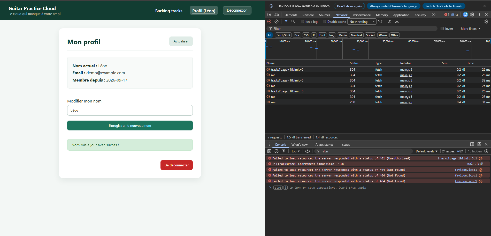

# Rapport d'usage de l'IA - TP1

Pour chaque mission, détailler et fournir des explications concernant : objectif; prompt principal; plan proposé par l'agent; vérifications réalisées par le binôme; erreurs ou propositions rejetées; fichiers effectivement modifiés; preuve de fonctionnement; ce que chaque membre sait maintenant expliquer sans l'agent.

# TP1

## Mission 0 :

Prompt : renseigne toi sur la mission 0 et explique moi
L'agent a fourni des explications complète :
    - une cartographie des éléments clés de l'application
    - un schéma annoté du flux lors de la connexion (via un code mermaid)
    -  une distinction des route grace a API_CONTRACT.md

J'ai ensuite géré le fichier .gitignore (également a l'aide de l'agent) pour comprendre pourquoi il y avait autant de fichier inutiles (c'était lié aux installations et modules), j'ai donc pu ensuite commit proprement.

J'ai redigé un fichier word avec les informations obtenue, pour avoir des notes ainsi que le diagramme mermaid.

## Mission 1 :

prompt 1 : Je dois faire cette mission 1, propose moi des solution et un plan d'implémentation en m'expliquant ce qui dois être fait et les choix possibles. Voici la consigne : (ici énoncé mission 1)

L'argent me fourni une explication de ce qu'il faut faire, avec mes options disponibles, avec un Implémentation Plan complet, des verifications a faire.

Je choisis les options, celles recomandées par l'agent, et il code étape par étape. Voici une capture d'écran attestant les vérifications : 

# TP2

## Mission 2 : Bibliothèque paginée

### 1. Objectif
Construire une bibliothèque audio agréable et robuste en utilisant la pagination côté serveur (`GET /api/tracks?page=...&limit=...`). L'état de l'interface doit être piloté par des Signals Angular (`tracks`, `page`, `pages`, `loading`, `error`), avec un affichage basé sur le control flow moderne (`@for`, `@empty`, `@if`) et des contrôles de navigation sécurisés aux bornes.

### 2. Prompt principal
> "re analyse pour être sur que tu va bien faire les choses et que c'est bien ce qui ait demandé, puis fait moins une synthèse de ce qu'il y a a faire concrètement et commence a implémenter.

### 3. Plan proposé par l'agent
1. **Contrat d'API et Service** : Vérifier que `TrackService.list(page, limit)` transmet bien les query params `{ params: { page, limit } }` et que l'intercepteur JWT injecte le header `Authorization`.
2. **Signals & Logique composant** : Ajouter le Signal manquant `error = signal<string | null>(null)`, sécuriser la pagination dans `go(page)` pour bloquer les débordements de bornes, et gérer les états `loading` et `error` dans `load()`.
3. **Template HTML** : Mettre en place le nouveau control flow Angular avec `@for`, `@empty` (quand la liste est vide sans erreur/chargement), `@if (error())` et `@if (loading())`, avec désactivation des boutons Précédent/Suivant aux bornes et pendant un chargement.
4. **Design & Ergonomie CSS** : Fournir une interface soignée avec des cards responsives, des badges, des boutons d'écoute audio stylisés et une barre de pagination claire.
5. **Vérification Network** : Contrôler dans l'onglet Réseau que chaque changement de page effectue bien un appel HTTP serveur distinct.

### 4. Vérifications réalisées par le binôme
- **Compilation** : Exécution de `npx ng build` réussie avec zéro erreur TypeScript/template.
- **Contrôles aux bornes** : À la page 1, le bouton « Préc. » est désactivé (`disabled`). À la page maximale `pages()`, le bouton « Suiv. » est désactivé.
- **Inspection Réseau (Network)** : Vérification de la transmission des requêtes `GET /api/tracks?page=1&limit=5` avec les query params et le header `Authorization: Bearer <token>`, ainsi que la réception du JSON `{ items, page, limit, total, pages }`.
- **Réactivité des Signals** : Test du bouton d'actualisation et du sélecteur de pistes par page modifiant instantanément la requête sans recharger l'application.

### 5. Erreurs ou propositions rejetées
- **Rejet de la pagination locale (client-side)** : Ne jamais récupérer toutes les pistes d'un coup pour les découper avec un `.slice()` côté Angular (interdit par le sujet pour préserver la bande passante et la mémoire).
- **Report de la dépendance Angular Material** : Ne pas installer lourdement `@angular/material` d'emblée afin de conserver un bundle léger et de maîtriser d'abord parfaitement la logique des Signals et du CSS natif.

### 6. Fichiers effectivement modifiés
- `frontend-starter/src/app/components/tracks-page/tracks-page.ts` : Ajout du signal `error`, mise à jour de `load()` et contrôle des bornes dans `go()`.
- `frontend-starter/src/app/components/tracks-page/tracks-page.html` : Intégration du bandeau d'erreur, états `@empty`, sécurisation des boutons `[disabled]`.
- `frontend-starter/src/app/components/tracks-page/tracks-page.css` : Styles modernes pour les cartes de pistes, les boutons de lecture, les messages d'état et la pagination.
- `RAPPORT_IA_MODELE.md` : Documentation et traçabilité de la mission 2.

### 7. Preuve de fonctionnement
- Le serveur backend répond avec le statut `200 OK` et le format paginé.
- Les boutons changent de page, déclenchent un nouveau fetch HTTP et mettent à jour dynamiquement la vue.
*(Insérer ici une capture d'écran de l'onglet Network montrant `GET /api/tracks?page=...&limit=5` et de l'interface)*

### 8. Ce que chaque membre sait maintenant expliquer sans l'agent
- **Pagination serveur vs client** : Pourquoi le backend utilise `skip((page - 1) * limit).limit(limit)` dans MongoDB et pourquoi le client doit ré-émettre une requête HTTP à chaque changement de page.
- **Réactivité avec Signals** : Comment instancier un `signal()`, le lire avec `this.signal()` ou dans le template avec `signal()`, et le mettre à jour avec `.set()`.
- **Nouveau Control Flow Angular** : Pourquoi utiliser `@for ... track track.id` et `@empty` plutôt que l'ancienne directive `*ngFor`.

