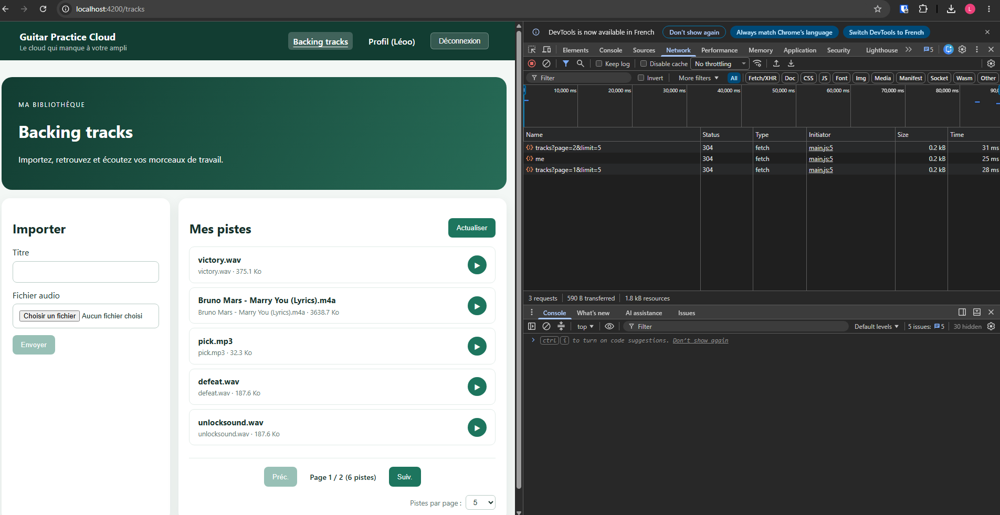
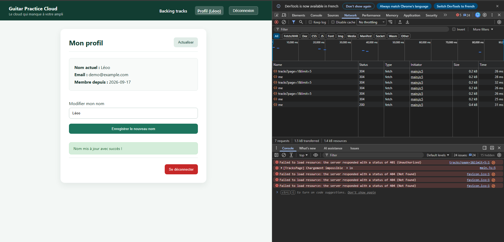

# Rapport d'usage de l'IA — TP1, TP2 & TP3

**Étudiant :** Léo Masoyé (travail individuel)  
**Outil utilisé :** Antigravity avec Gemini Pro  
**Gestion des tokens & modèles :** Suivi de la consommation via les paramètres d'Antigravity (paramètres -> modèles), j'autilise geminni pro la plupart du temps, mais gemini flash pour des questions plus simple et des petites corrections, et parfois claude (il y a un accès, certes plus limité en token, via l'abonnement a gemini pro que j'ai actuellement)
---

# TP1 — Architecture, Authentification et Profil

## Mission 0 — Cartographie de l'application

- **Objectif :** Prendre en main le projet avant de coder : comprendre le rôle des composants, le routage, le flux JWT et identifier les routes publiques et protégées dans API_CONTRACT.md.
- **Démarche avec l'agent :**
  - J'ai demandé à l'agent d'analyser le code existant et de m'expliquer l'architecture globale.
  - Il m'a fourni un schéma de flux pour la connexion (Angular → Service → Intercepteur JWT → API Express → MongoDB) et m'a aidé à bien distinguer les routes publiques (/api/auth/*, /api/health) des routes protégées (/api/users/me, /api/tracks).
  - L'agent m'a également aidé à configurer proprement le fichier .gitignore pour éviter de versionner node_modules et les fichiers temporaires.
- **Ce que je retiens :** L'intercepteur HTTP (authInterceptor) est au centre de l'authentification : il injecte automatiquement l'en-tête Authorization: Bearer <token> sur chaque requête protégée dès qu'un token est présent. (j'ai découvert avec l'ia que cet en tête était le mécanisme standard dans les requetes http pour s'autentifier, ici grâce au jwt configuré donc)

---

## Mission 1 — Inscription, Connexion et Profil réactif

- **Objectif :** Implémenter les formulaires réactifs d'authentification, sauvegarder le JWT et rendre la page de profil réactive avec modification du nom.
- **Démarche avec l'agent :**
  - Prompt : Je lui ai soumis le sujet de la Mission 1 en lui demandant de me proposer un plan d'implémentation par étapes.
  - L'agent m'a proposé une structure claire (service d'authentification, formulaires avec validations, mise à jour de l'état utilisateur via Signal). Il m'a posé des questions sur mes préférences (maintenant possible directement avec un questionnaire interactif sur antigravity, très pratique), puis a démarré les étapes.
- **Vérifications réalisées :**
  - Formulaires : validation de l'email et des champs requis avec messages d'erreur clairs.
  - Déconnexion : suppression du token et redirection immédiate vers /login.
  - Profil : modification du nom prise en compte instantanément dans l'interface avec message de confirmation.
  - Réseau : vérification dans l'onglet Network du navigateur (f12) des requêtes GET /api/users/me et PUT /api/users/me avec code HTTP 200 et présence du header Authorization.
- **Preuve de fonctionnement :**  
  
- **Questions & notions clés :**
  - **Signal vs localStorage :** Le localStorage sert uniquement à persister le JWT sur le disque du navigateur pour rester connecté après un rafraîchissement (F5). Le Signal Angular (currentUser) gère l'état dynamique en mémoire vive : dès qu'il est mis à jour, Angular réactualise instantanément les éléments du DOM qui en dépendent.
  - **Où s'effectue la mise à jour du profil ?** Côté frontend, elle part de profile-page.ts via l'appel AuthService.updateProfile(). Côté backend, elle est traitée dans backend/src/routes/user.routes.js (ou app.js) qui reçoit le PUT /api/users/me, récupère l'identifiant utilisateur dans le token décodé par le middleware d'authentification, et met à jour le document correspondant dans MongoDB.

---

# TP2 — Bibliothèque Audio, Pagination et Upload

## Mission 2 — Bibliothèque audio paginée

- **Objectif :** Mettre en place une bibliothèque paginée côté serveur (GET /api/tracks?page=...&limit=...) en gérant l'état avec des Signals et le nouveau control flow Angular (@for, @empty, @if).
- **Démarche avec l'agent :**
  - Prompt : J'ai demandé à l'agent de synthétiser ce qu'exigeait le sujet et d'implémenter la pagination proprement sans modifier le backend.
  - Nous avons structuré le composant avec des Signals clairs (tracks, page, pages, loading, error) et sécurisé les boutons de pagination.
- **Choix et vérifications :**
  - *Rejet de la pagination locale :* Pas de découpage avec .slice() côté client. Chaque changement de page envoie bien une nouvelle requête HTTP avec les paramètres page et limit.
  - *Gestion des bornes :* Bouton « Précédent » désactivé sur la page 1, bouton « Suivant » désactivé sur la dernière page.
  - *Affichage :* Utilisation du control flow moderne @for pour la liste et @empty pour le cas où aucune piste n'existe.
- **Preuve de fonctionnement :**  
  
- **Ce que je retiens :** La pagination serveur préserve la bande passante : le backend n'extrait de MongoDB que les documents demandés (skip + limit), pas toute la collection.

---

## Mission 3 — Upload et lecture audio sécurisée

- **Objectif :** Uploader des fichiers audio avec validation et retour visuel, et permettre la lecture via un lecteur HTML sécurisé.
- **Démarche avec l'agent :**
  - Prompt : J'ai demandé à l'agent de me cartographier le flux d'upload et de lecture déjà présent dans le code, puis de m'aider à compléter ce qui manquait côté frontend.
  - On a travaillé en deux temps : d'abord comprendre le mécanisme existant, ensuite ajouter la validation et les retours visuels.
- **Ce que j'ai mis en place :**
  - Vérification côté navigateur du format et de la taille (< 25 Mo) avant d'envoyer le FormData — le backend valide aussi, mais ça évite des requêtes inutiles.
  - Bouton désactivé pendant l'envoi, message de succès ou d'erreur, et retour automatique à la page 1 après upload.
  - Pour la lecture : impossible de mettre directement le JWT dans un `<audio src="...">`, donc on passe par HttpClient → Blob → URL.createObjectURL(blob). C'est l'intercepteur qui ajoute le header Authorization au passage.
  - Ajout de URL.revokeObjectURL() dans ngOnDestroy pour libérer la mémoire quand on change de morceau ou quitte la page.
- **Ce que je retiens :** Le navigateur ne peut pas ajouter de headers HTTP sur une balise `<audio>` directement — il faut forcément passer par HttpClient. Et sans revokeObjectURL, le fichier reste bloqué en mémoire heap indéfiniment.
- **Questions sur mémoire et streaming :**
  - Le backend envoie le fichier progressivement via res.sendFile() (streams Node.js), pas d'un bloc en RAM.
  - Avec responseType: "blob", le composant reçoit le Blob seulement quand le téléchargement est terminé.
  - La liste paginée ne charge que les métadonnées JSON — les fichiers audio ne sont récupérés que si l'utilisateur clique sur Écouter.
  - Avec 100 balises `<audio src>` directes, le navigateur ferait 100 requêtes en parallèle sans pouvoir transmettre le token.

---

# TP3 — Fiabilisation et enrichissement du frontend

## Mission 5 — Suppression d'une piste

- **Objectif :** Ajouter la suppression de pistes avec confirmation et retour visuel.
- **Démarche avec l'agent :**
  - Prompt : J'ai demandé à l'agent d'implémenter la suppression en passant bien par TrackService, avec une confirmation et un feedback utilisateur. On a opté pour un SnackBar CSS maison + window.confirm() plutôt qu'Angular Material pour rester cohérent avec le reste du projet.
- **Ce que j'ai mis en place :**
  - Méthode delete(id) dans TrackService qui appelle DELETE /api/tracks/:id.
  - Bouton de suppression désactivé pendant l'opération pour éviter les double-clics.
  - Gestion des cas d'erreur 403 (pas le propriétaire) et 404 (piste déjà supprimée ailleurs).
- **Ce que je retiens :** Le guard Angular empêche d'accéder à la page sans token, mais c'est bien le backend qui vérifie vraiment si l'utilisateur est propriétaire de la piste — le frontend seul ne suffit pas.

---

## Mission 6 — Progression de l'upload

- **Objectif :** Afficher une barre de progression en temps réel pendant l'envoi d'un fichier.
- **Démarche avec l'agent :**
  - J'ai demandé à l'agent de faire évoluer la méthode d'upload existante pour exploiter les événements HTTP Angular, et d'ajouter une barre de progression animée en CSS.
- **Ce que j'ai mis en place :**
  - Ajout de { reportProgress: true, observe: 'events' } dans l'appel HttpClient.
  - Interception des événements HttpEventType.UploadProgress pour calculer le pourcentage : Math.round(100 * event.loaded / event.total).
  - Barre de progression animée qui s'affiche pendant l'envoi et disparaît à la fin.
- **Ce que je retiens :** Contrairement à une requête normale qui émet une seule réponse finale, ici HttpClient émet une série d'événements au fil de l'envoi — il faut donc subscribe et filtrer les types d'événements manuellement.

---

## Mission 7 — Tests automatisés

- **Objectif :** Écrire des tests unitaires frontend qui fonctionnent sans backend ni MongoDB.
- **Démarche avec l'agent :**
  - J'ai demandé à l'agent de m'aider à configurer l'environnement de test et d'écrire 3 tests ciblés sur les points critiques du projet.
- **Ce que j'ai mis en place :**
  - *Test 1 (AuthService)* : vérifie que login() appelle bien POST /api/auth/login avec les bons identifiants et sauvegarde le token en localStorage.
  - *Test 2 (AuthGuard)* : vérifie que le guard laisse passer si token présent, et redirige vers /login sinon.
  - *Test 3 (TrackService)* : vérifie que l'upload émet des événements UploadProgress et se termine correctement.
- **Vérifications finales :**
  - npm run test -- --watch=false : tous les tests passent.
  - npm run build : build de production sans erreur.
- **Ce que je retiens :** Avec HttpTestingController, on simule les réponses HTTP côté client — les tests sont complètement isolés et reproductibles, sans dépendance au serveur.

